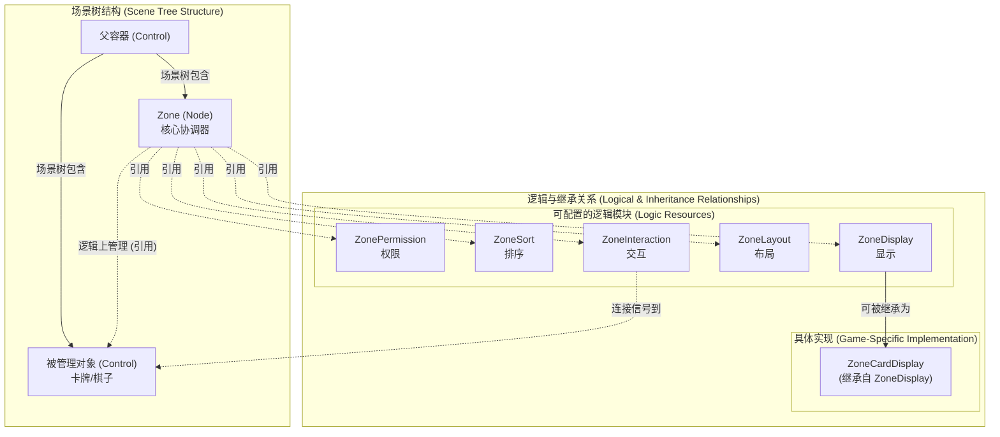
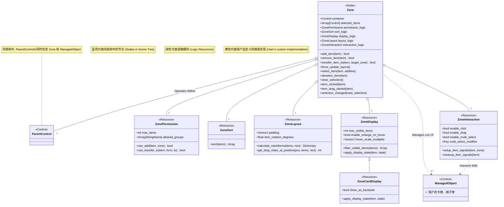

# 施工中/Under Active Development

## 结构

```mermaid
graph TD
    subgraph "场景树结构 (Scene Tree Structure)"
        ParentControl["父容器 (Control)"]
        ParentControl -- "场景树包含" --> Zone["Zone (Node)<br/>核心协调器"]
        ParentControl -- "场景树包含" --> ManagedObject["被管理对象 (Control)<br/>卡牌/棋子"]
    end

    subgraph "逻辑与继承关系 (Logical & Inheritance Relationships)"
        subgraph "可配置的逻辑模块 (Logic Resources)"
            LP[ZonePermission<br/>权限]
            LS[ZoneSort<br/>排序]
            LD[ZoneDisplay<br/>显示]
            LL[ZoneLayout<br/>布局]
            LI[ZoneInteraction<br/>交互]
        end

        subgraph "具体实现 (Game-Specific Implementation)"
            CardDisplay["ZoneCardDisplay<br/>(继承自 ZoneDisplay)"]
        end

        %% 核心逻辑关系
        Zone -. "逻辑上管理 (引用)" .-> ManagedObject
        Zone -. "引用" .-> LP
        Zone -. "引用" .-> LS
        Zone -. "引用" .-> LD
        Zone -. "引用" .-> LL
        Zone -. "引用" .-> LI

        %% 交互关系
        LI -. "连接信号到" .-> ManagedObject

        %% 继承关系
        LD -- "可被继承为" --> CardDisplay
    end
```

## 类图

```mermaid
classDiagram
    %% --- Notes explaining the diagram conventions ---
    note "蓝色代表场景树中的节点 (Nodes in Scene Tree)"
    note "绿色代表逻辑模块 (Logic Resources)"
    note "黄色代表用户自定义的继承实现 (User's custom implementation)"

    %% --- Classes in the Scene Tree ---
    class ParentControl {
        <<Control>>
    }
    class Zone {
        <<Node>>
        <<Properties>>
        +Control container
        +Array[Control] selected_items
        +ZonePermission permission_logic
        +ZoneSort sort_logic
        +ZoneDisplay display_logic
        +ZoneLayout layout_logic
        +ZoneInteraction interaction_logic
        <<Methods>>
        +add_item(item) bool
        +remove_item(item) bool
        +transfer_item_to(item, target_zone) bool
        +force_update_layout()
        +select_item(item, additive)
        +deselect_item(item)
        +clear_selection()
        <<Signals>>
        +item_clicked(item)
        +item_drag_started(item)
        +selection_changed(new_selection)
    }
    class ManagedObject {
        <<Control>>
        + '用户的卡牌、棋子等'
    }

    %% --- Logic Module Base Classes (Resources) ---
    class ZonePermission {
        <<Resource>>
        <<Properties>>
        +int max_items
        +Array[StringName] allowed_groups
        <<Methods>>
        +can_add(item, zone) bool
        +can_transfer_in(item, from, to) bool
    }
    class ZoneSort {
        <<Resource>>
        <<Methods>>
        +sort(items) Array
    }
    class ZoneLayout {
        <<Resource>>
        <<Properties>>
        +Vector2 padding
        +float item_rotation_degrees
        <<Methods>>
        +calculate_transforms(items, rect) Dictionary
        +get_drop_index_at_position(pos, items, rect) int
    }
    class ZoneDisplay {
        <<Resource>>
        <<Properties>>
        +int max_visible_items
        +bool enable_enlarge_on_hover
        +Vector2 hover_scale_multiplier
        <<Methods>>
        +filter_visible_items(items) Array
        +apply_display_state(item, state)
    }
    class ZoneInteraction {
        <<Resource>>
        <<Properties>>
        +bool enable_click
        +bool enable_drag
        +bool enable_multi_select
        +Key multi_select_modifier
        <<Methods>>
        +setup_item_signals(item, zone)
        +cleanup_item_signals(item)
    }

    %% --- User's Custom Implementation Example ---
    class ZoneCardDisplay {
        <<Resource>>
        <<Properties>>
        +bool show_as_backside
        <<Methods>>
        +apply_display_state(item, state)
    }

    %% --- Relationships ---
    note for ParentControl "场景树中, ParentControl\n同时包含 Zone 和 ManagedObject"

    Zone o-- "1" ParentControl : Operates Within
    Zone o-- "1" ZonePermission
    Zone o-- "1" ZoneSort
    Zone o-- "1" ZoneLayout
    Zone o-- "1" ZoneDisplay
    Zone o-- "1" ZoneInteraction

    Zone ..> "0..*" ManagedObject : Manages List Of

    ZoneInteraction ..> ManagedObject : Interacts With

    ZoneDisplay <|-- ZoneCardDisplay
```