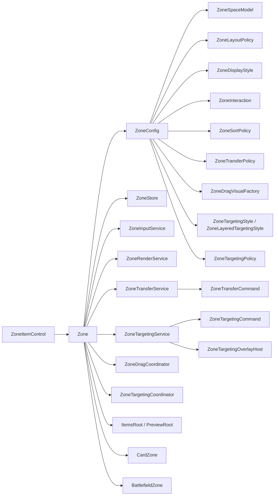

# NascentSoul

NascentSoul is a Godot 4.6 zone toolkit for card games and battlefield tactics. It centers on a UI-native `Zone` control, a `ZoneConfig` resource, typed runtime services, and a managed `ZoneItemControl` base class.

It ships with:

- `CardZone` for ordered, linear card containers such as hand, deck, discard, shop, and board rows
- `BattlefieldZone` for square and hex grids with occupancy, card-to-board transfer, and piece spawning
- Built-in targeting for arrow-driven spell and ability selection across items and board cells

`Zone` stays inspector-friendly through `ZoneConfig` and composable resources. Layout, display, interaction, sorting, transfer rules, drag visuals, and targeting all remain resource-driven.

## Architecture


```mermaid
flowchart LR
    Zone["Zone"] --> Config["ZoneConfig"]
    Zone --> Store["ZoneStore"]
    Zone --> Input["ZoneInputService"]
    Zone --> Render["ZoneRenderService"]
    Zone --> Transfer["ZoneTransferService"]
    Zone --> Targeting["ZoneTargetingService"]
    Zone --> DragCoord["ZoneDragCoordinator"]
    Zone --> TargetCoord["ZoneTargetingCoordinator"]
    Zone --> Items["ItemsRoot / PreviewRoot"]
    Config --> Space["ZoneSpaceModel"]
    Config --> Layout["ZoneLayoutPolicy"]
    Config --> Display["ZoneDisplayStyle"]
    Config --> Interaction["ZoneInteraction"]
    Config --> Sort["ZoneSortPolicy"]
    Config --> TransferPolicy["ZoneTransferPolicy"]
    Config --> DragVisual["ZoneDragVisualFactory"]
    Config --> TargetStyle["ZoneTargetingStyle / ZoneLayeredTargetingStyle"]
    Config --> TargetPolicy["ZoneTargetingPolicy"]
    Transfer --> TransferCommand["ZoneTransferCommand"]
    Targeting --> TargetCommand["ZoneTargetingCommand"]
    Targeting --> TargetHost["ZoneTargetingOverlayHost"]
    Zone --> CardFamily["CardZone"]
    Zone --> BattlefieldFamily["BattlefieldZone"]
    ZoneItem["ZoneItemControl"] --> Zone
```

The important split in `1.0.0` is:

- `ZoneConfig` owns composition and inspector-facing policy wiring
- `ZoneStore` owns item order, placement, selection, and transfer handoff state
- `ZoneInputService`, `ZoneRenderService`, `ZoneTransferService`, and `ZoneTargetingService` own runtime behavior
- `Zone` is the public node API and the single owner of signals such as selection, drop preview, transfer, and targeting callbacks

## Why This Shape Works

- Card zones and battlefield zones share one transfer and preview protocol without pretending they are the same spatial model.
- Linear insertion and grid placement both flow through `ZonePlacementTarget`.
- A transfer can keep a `ZoneCard` as-is or resolve into a spawned `ZonePiece`, depending on the target zone's transfer rules.
- Targeting visuals are library-owned. `ZoneLayeredTargetingStyle`, `ZoneTargetingVisualLayer`, and `ZoneTargetingOverlayHost` live in the addon; demo scenes only configure built-in presets or per-intent overrides.

## Quick Start

### Card Zone

```gdscript
var hand := CardZone.new()
hand.custom_minimum_size = Vector2(360, 220)
hand.size = hand.custom_minimum_size
hand.config = load("res://addons/nascentsoul/presets/hand_zone_config.tres")
add_child(hand)

var card := ZoneCard.new()
card.data = CardData.new()
card.data.title = "Spark"
card.face_up = true

hand.add_item(card)
```

### Battlefield Zone

```gdscript
var field := BattlefieldZone.new()
field.custom_minimum_size = Vector2(560, 420)
field.size = field.custom_minimum_size
field.config = load("res://addons/nascentsoul/presets/battlefield_square_zone_config.tres")
add_child(field)

var card := ZoneCard.new()
card.data = CardData.new()
card.data.title = "Aegis"
card.face_up = true

field.add_item(card, ZonePlacementTarget.square(1, 1))
```

### Card To Battlefield

```gdscript
hand.perform_transfer(
	ZoneTransferCommand.transfer_between(
		hand,
		field,
		[card],
		ZonePlacementTarget.hex(2, 1)
	)
)
```

If the target battlefield uses a `ZoneTransferPolicy` that returns `SPAWN_PIECE`, the source card is consumed and the battlefield inserts a `ZonePiece` instead.

### Targeting

```gdscript
extends ZoneCard
class_name MeteorCard

func create_zone_targeting_intent(_command: ZoneTargetingCommand, _entry_mode: StringName) -> ZoneTargetingIntent:
	var intent := ZoneTargetingIntent.new()
	intent.allowed_candidate_kinds = PackedInt32Array([ZoneTargetCandidate.CandidateKind.ITEM])
	intent.policy = ZoneTargetAllowAllPolicy.new()
	return intent
```

```gdscript
var piece_intent := ZoneTargetingIntent.new()
piece_intent.allowed_candidate_kinds = PackedInt32Array([ZoneTargetCandidate.CandidateKind.PLACEMENT])

battlefield.begin_targeting(
	ZoneTargetingCommand.explicit_for_item(battlefield, piece, piece_intent)
)
```

`targeting_resolved` reports what the player chose, but it does not automatically consume the source card, cast the effect, or move the piece. Gameplay scripts stay in control of resolution.

### Targeting Visuals

- `ZoneArrowTargetingStyle` is the built-in classic preset and the compatibility path for the original arrow look.
- `ZoneLayeredTargetingStyle` is the new extension point for layered visuals.
- `ZoneTargetPathLayer`, `ZoneTargetHeadLayer`, `ZoneTargetEndpointLayer`, and `ZoneTargetTrailLayer` are the built-in primitives for custom effects.
- The addon now ships four ready-to-use preset resources: `Classic Arrow`, `Arcane Bolt`, `Strike Vector`, and `Tactical Beam`.
- `ZoneTargetingIntent.style_override` can swap the visual preset for one cast or ability without changing the zone's default style resource.

## Transfer vs Targeting

- Use transfer when the source object should move or spawn into another zone.
- Use targeting when the source object should stay where it is and only choose an entity or a cell.
- A drag gesture can branch into either system: items with `create_zone_targeting_intent()` enter arrow targeting, and everything else stays on normal drag/drop.
- `begin_targeting()` is the explicit path for skills, buttons, long-press actions, and scripted abilities.

## Built-In Families

- Managed item base: `ZoneItemControl`
- Linear space: `ZoneLinearSpaceModel`
- Square grid space: `ZoneSquareGridSpaceModel`
- Hex grid space: `ZoneHexGridSpaceModel`
- Card layouts: hand, hbox, vbox, pile
- Battlefield layout: `ZoneBattlefieldLayout`
- Transfer rules: allow-all, capacity, source, occupancy, composite, rule-table
- Targeting rules: allow-all, composite, rule-table
- Targeting visuals: `ZoneArrowTargetingStyle`, `ZoneLayeredTargetingStyle`, path/head/endpoint/trail layers, and built-in presets
- Example items: `ZoneCard + CardData`, `ZonePiece + PieceData`

## Learn By Opening The Repo

- [`scenes/examples/transfer_playground.tscn`](scenes/examples/transfer_playground.tscn): end-to-end card flow across deck, hand, board, and discard
- [`scenes/examples/policy_lab.tscn`](scenes/examples/policy_lab.tscn): source and capacity rules
- [`scenes/examples/layout_gallery.tscn`](scenes/examples/layout_gallery.tscn): linear layout comparison
- [`scenes/examples/zone_recipes.tscn`](scenes/examples/zone_recipes.tscn): copyable card-zone starter setups
- [`scenes/examples/battlefield_square_lab.tscn`](scenes/examples/battlefield_square_lab.tscn): square battlefield with direct card placement
- [`scenes/examples/battlefield_hex_lab.tscn`](scenes/examples/battlefield_hex_lab.tscn): hex battlefield with spatial placement
- [`scenes/examples/battlefield_transfer_modes.tscn`](scenes/examples/battlefield_transfer_modes.tscn): direct-place-card vs spawn-piece transfer rules
- [`scenes/examples/targeting_lab.tscn`](scenes/examples/targeting_lab.tscn): drag-to-target spell flow, preset switching, and explicit style overrides for abilities

The editor plugin exposes:

- `Create Card Zone`
- `Create Square Battlefield Zone`
- `Create Hex Battlefield Zone`

## Validation

Current repository validation on Godot 4.6.1:

- Headless regression suite passes with `423` checks
- Headless editor/plugin load passes without parse errors or preload failures
- Transfer, battlefield, layout, and targeting suites all remain green on the current architecture

## Project Status

NascentSoul `1.0.0` is the first stable release of the current architecture: `Zone` is a real `Control`, configuration lives in `ZoneConfig`, runtime state is split across typed services, and targeting is part of the addon itself instead of demo-only code.
