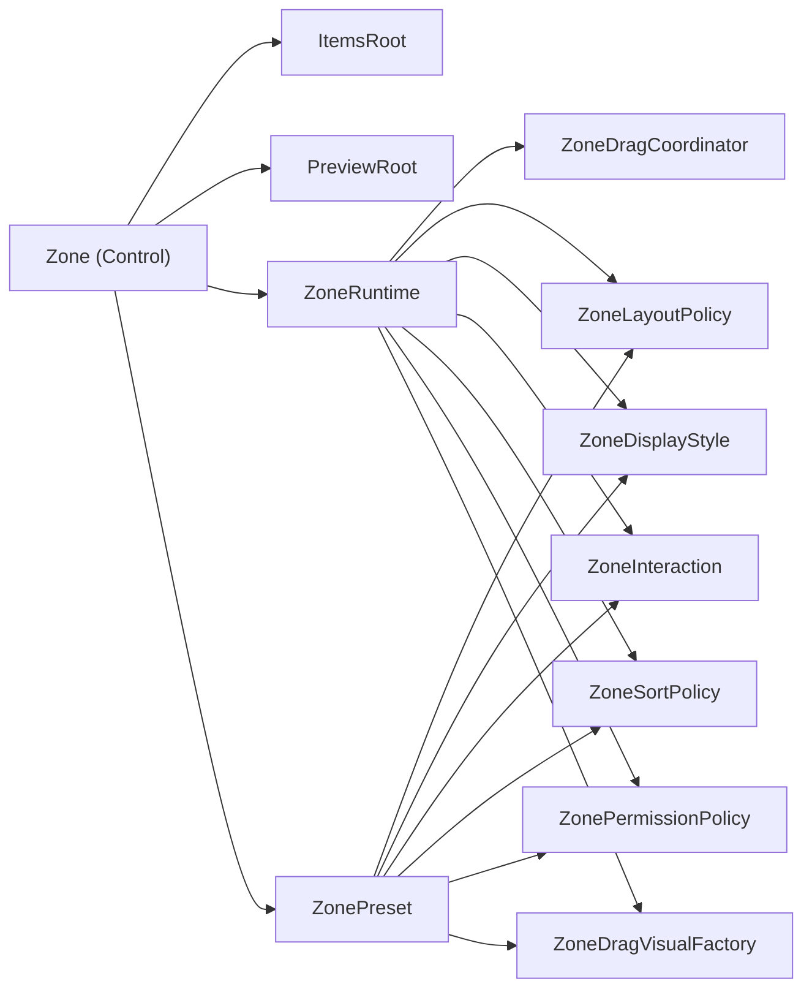

# NascentSoul

NascentSoul is a Godot 4.6 card-zone plugin built around one idea: a zone should feel like a real UI component, while its behavior stays modular. `Zone` is the actual `Control` you place in the scene, and layout, display, drag/drop permissions, sorting, interaction rules, and drag visuals are all composed from resources instead of being hardwired into one monolith.

## Architecture


```mermaid
flowchart LR
    Zone["Zone (Control)"] --> Items["ItemsRoot"]
    Zone --> Preview["PreviewRoot"]
    Zone --> Runtime["ZoneRuntime"]
    Zone --> Preset["ZonePreset"]
    Preset --> Layout["ZoneLayoutPolicy"]
    Preset --> Display["ZoneDisplayStyle"]
    Preset --> Interaction["ZoneInteraction"]
    Preset --> Sort["ZoneSortPolicy"]
    Preset --> Permission["ZonePermissionPolicy"]
    Preset --> DragVisual["ZoneDragVisualFactory"]
    Runtime --> Coordinator["ZoneDragCoordinator"]
    Runtime --> Layout
    Runtime --> Display
    Runtime --> Interaction
    Runtime --> Sort
    Runtime --> Permission
    Runtime --> DragVisual
```

- `Zone` is the UI surface. It owns input, sizing, theme, `ItemsRoot`, and `PreviewRoot`.
- `ZoneRuntime` owns live state. Selection, drag sessions, hover feedback, display caches, and transfer handoff data live here instead of inside shared `Resource` instances.
- `ZonePreset` is the inspector-friendly entry point. It bundles common combinations of `ZoneLayoutPolicy`, `ZoneDisplayStyle`, `ZoneInteraction`, `ZoneSortPolicy`, `ZonePermissionPolicy`, and `ZoneDragVisualFactory`.
- `ItemsRoot` is the only source of managed items. `PreviewRoot` is reserved for ghost and preview visuals and never participates in logical item order.
- `ZoneDragCoordinator` handles scene-level drag orchestration so cross-zone movement stays predictable without pushing runtime state into globals.

## Why This Shape Works

- It matches how card games are actually authored in Godot: zones are visible controls, not invisible coordinators hanging off another node.
- Behavior stays composable. A hand, board, pile, discard, or custom area is mostly a different combination of policies and styles, not a different subsystem.
- Runtime state stays local and safe. You can reuse presets and policy resources without leaking selection state, tween caches, or drag state across zones.
- The same core pipeline covers inspector-authored scenes, scripted setup, drag/drop, keyboard navigation, and demo recipes.

## Quick Start

```gdscript
var zone := Zone.new()
zone.custom_minimum_size = Vector2(320, 220)
zone.size = zone.custom_minimum_size
zone.preset = load("res://addons/nascentsoul/presets/hand_zone_preset.tres")
add_child(zone)

var data := CardData.new()
data.title = "Spark"

var card := ZoneCard.new()
card.data = data
card.face_up = true

zone.add_item(card)
```

Configuration precedence is always:

`override > ZonePreset > built-in default`

The authored shape is simple:

- Put managed items under `ItemsRoot`.
- Let `PreviewRoot` stay runtime-only.
- Treat `Zone` itself as the area, not as a helper attached to some external container.

## Learn by Opening the Repo

- [`scenes/demo.tscn`](scenes/demo.tscn): example hub and the fastest way to inspect the plugin in context.
- [`scenes/examples/transfer_playground.tscn`](scenes/examples/transfer_playground.tscn): end-to-end card flow from deck to hand, board, and discard.
- [`scenes/examples/layout_gallery.tscn`](scenes/examples/layout_gallery.tscn): compare hand, row, grouped-list, and pile layouts side by side.
- [`scenes/examples/permission_lab.tscn`](scenes/examples/permission_lab.tscn): inspect capacity and source-based drop rules.
- [`scenes/examples/zone_recipes.tscn`](scenes/examples/zone_recipes.tscn): copyable starter setup for deck, hand, board, and discard zones.

The editor plugin exposes these entry points directly:

- `Create Zone From Preset`
- `Open NascentSoul Example Hub`
- `Open NascentSoul Zone Recipes`
- `Open NascentSoul README`

## Project Status

NascentSoul `1.0.0` marks the current public shape: `Zone extends Control`, inspector-driven presets, modular runtime behavior, and scene-authored examples as the canonical source of usage. The architecture is intended to be the stable foundation of the plugin going forward.
