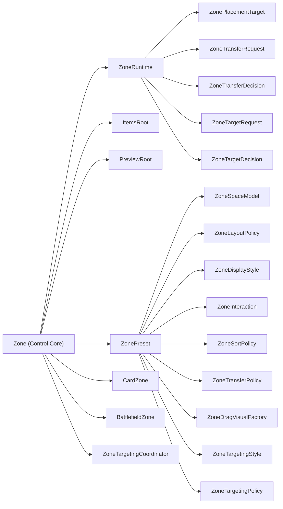

# NascentSoul

NascentSoul is a Godot 4.6 zone toolkit for both card games and battlefield tactics. It keeps one shared `Zone` core for selection, drag/drop, display, preview, and runtime state, then lets each family swap in the right spatial model:

- `CardZone` for ordered, linear card containers such as hand, deck, discard, shop, and board rows
- `BattlefieldZone` for square and hex grids with cell occupancy, piece movement, and card-to-board transfer rules
- Built-in targeting for arrow-driven spell and ability selection across items and board cells

`Zone` stays inspector-friendly through presets and composable resources. Layout, display, interaction, transfer rules, space resolution, sorting, and drag visuals are all resources instead of hardcoded branches.

## Architecture


```mermaid
flowchart LR
    Zone["Zone (Control Core)"] --> Runtime["ZoneRuntime"]
    Zone --> Items["ItemsRoot"]
    Zone --> Preview["PreviewRoot"]
    Zone --> Preset["ZonePreset"]
    Preset --> Space["ZoneSpaceModel"]
    Preset --> Layout["ZoneLayoutPolicy"]
    Preset --> Display["ZoneDisplayStyle"]
    Preset --> Interaction["ZoneInteraction"]
    Preset --> Sort["ZoneSortPolicy"]
    Preset --> Transfer["ZoneTransferPolicy"]
    Preset --> DragVisual["ZoneDragVisualFactory"]
    Preset --> TargetStyle["ZoneTargetingStyle"]
    Preset --> TargetPolicy["ZoneTargetingPolicy"]
    Runtime --> Placement["ZonePlacementTarget"]
    Runtime --> Request["ZoneTransferRequest"]
    Runtime --> Decision["ZoneTransferDecision"]
    Runtime --> TargetRequest["ZoneTargetRequest"]
    Runtime --> TargetDecision["ZoneTargetDecision"]
    Zone --> CardFamily["CardZone"]
    Zone --> BattleFamily["BattlefieldZone"]
    Zone --> Targeting["ZoneTargetingCoordinator"]
```

The important split in `2.0.0` is:

- `ZoneSpaceModel` decides where a drop lands
- `ZoneLayoutPolicy` decides how managed items render
- `ZoneTransferPolicy` decides whether a move is allowed and whether it directly places the item or spawns a piece
- `ZoneTargetingPolicy` decides whether a dragged or explicit targeting session can lock onto an item or a placement target

## Why This Shape Works

- Card zones and battlefield zones share the same drag/drop and preview core without pretending they are the same data model.
- Linear index insertion and spatial cell placement both travel through a single `ZonePlacementTarget` protocol.
- A card can move into a battlefield as a card or resolve into a `ZonePiece`, depending on the target zone's transfer rules.
- Square and hex battlefields stay in one family. Geometry is a `ZoneSpaceModel`, not a new subsystem.

## Quick Start

### Card Zone

```gdscript
var hand := CardZone.new()
hand.custom_minimum_size = Vector2(360, 220)
hand.size = hand.custom_minimum_size
hand.preset = load("res://addons/nascentsoul/presets/hand_zone_preset.tres")
add_child(hand)

var card := ZoneCard.new()
card.data = CardData.new()
card.data.title = "Spark"
card.face_up = true

hand.add_item(card)
```

### Battlefield Zone

```gdscript
var field := BattlefieldZone.new()
field.custom_minimum_size = Vector2(560, 420)
field.size = field.custom_minimum_size
field.preset = load("res://addons/nascentsoul/presets/battlefield_square_zone_preset.tres")
add_child(field)

var card := ZoneCard.new()
card.data = CardData.new()
card.data.title = "Aegis"
card.face_up = true

field.add_item(card, ZonePlacementTarget.square(1, 1))
```

### Card To Battlefield

```gdscript
var target := ZonePlacementTarget.hex(2, 1)
hand.move_item_to(card, field, target)
```

If the target battlefield uses a `ZoneTransferPolicy` that returns `SPAWN_PIECE`, the source card is consumed and the battlefield inserts a `ZonePiece` instead.

### Targeting

```gdscript
extends ZoneCard
class_name MeteorCard

func create_zone_targeting_intent(_source_zone: Zone, _entry_mode: StringName) -> ZoneTargetingIntent:
	var intent := ZoneTargetingIntent.new()
	intent.allowed_candidate_kinds = PackedInt32Array([ZoneTargetCandidate.CandidateKind.ITEM])
	intent.policy = ZoneTargetAllowAllPolicy.new()
	return intent
```

```gdscript
var piece_intent := ZoneTargetingIntent.new()
piece_intent.allowed_candidate_kinds = PackedInt32Array([ZoneTargetCandidate.CandidateKind.PLACEMENT])

battlefield.begin_targeting(piece, piece_intent)
```

`targeting_resolved` reports what the player chose, but it does not automatically consume the source card, cast the effect, or move the piece. Gameplay scripts stay in control of resolution.

## Transfer vs Targeting

- Use transfer when the source object should move or spawn into another zone.
- Use targeting when the source object should stay where it is and only choose an entity or a cell.
- A drag gesture can now branch into either system: items with `create_zone_targeting_intent()` enter arrow targeting, and everything else stays on normal drag/drop.
- `begin_targeting()` is the explicit path for skills, buttons, long-press actions, and scripted abilities.

## Built-In Families

- Linear space: `ZoneLinearSpaceModel`
- Square grid space: `ZoneSquareGridSpaceModel`
- Hex grid space: `ZoneHexGridSpaceModel`
- Card layouts: hand, hbox, vbox, pile
- Battlefield layout: `ZoneBattlefieldLayout`
- Transfer rules: allow-all, capacity, source, occupancy, composite, rule-table
- Targeting rules: allow-all, composite, rule-table
- Example items: `ZoneCard + CardData`, `ZonePiece + PieceData`

## Learn By Opening The Repo

- [`scenes/examples/transfer_playground.tscn`](scenes/examples/transfer_playground.tscn): end-to-end card flow across deck, hand, board, and discard
- [`scenes/examples/policy_lab.tscn`](scenes/examples/policy_lab.tscn): source and capacity rules
- [`scenes/examples/layout_gallery.tscn`](scenes/examples/layout_gallery.tscn): linear layout comparison
- [`scenes/examples/zone_recipes.tscn`](scenes/examples/zone_recipes.tscn): copyable card-zone starter setups
- [`scenes/examples/battlefield_square_lab.tscn`](scenes/examples/battlefield_square_lab.tscn): square battlefield with direct card placement
- [`scenes/examples/battlefield_hex_lab.tscn`](scenes/examples/battlefield_hex_lab.tscn): hex battlefield with spatial placement
- [`scenes/examples/battlefield_transfer_modes.tscn`](scenes/examples/battlefield_transfer_modes.tscn): direct-place-card vs spawn-piece transfer rules
- [`scenes/examples/targeting_lab.tscn`](scenes/examples/targeting_lab.tscn): drag-to-target spell flow and explicit piece ability targeting

The editor plugin now exposes:

- `Create Card Zone`
- `Create Square Battlefield Zone`
- `Create Hex Battlefield Zone`

## Validation

Current repository validation on Godot 4.6.1:

- Headless regression suite passes with `383` checks
- Card-only demos still pass their previous smoke and regression coverage
- Battlefield coverage now includes square and hex placement, occupancy rejection, spawn-piece transfer, and same-zone piece movement
- Targeting coverage now includes drag-started targeting, explicit `begin_targeting()`, item-vs-cell resolution, policy merging, overlay state changes, and cleanup

## Project Status

NascentSoul `2.1.0` keeps the `2.0` card/battlefield runtime and adds a dedicated targeting layer on top of it. The public drop protocol is still `ZonePlacementTarget`-based, and the repository examples now cover direct transfers, piece spawning, and arrow-driven targeting for spells and unit abilities.
