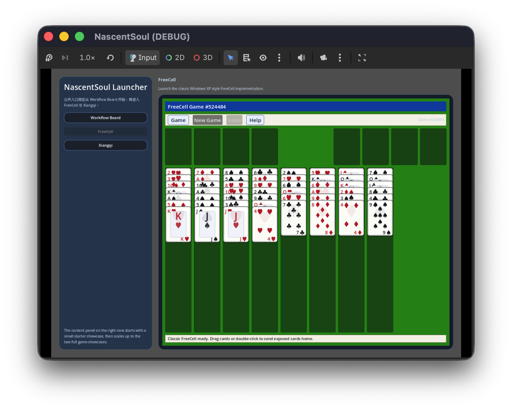

# NascentSoul

NascentSoul is a Godot 4.6 addon for building **card-style lanes** and **tactical board surfaces** with one consistent zone model.

It is meant for projects that want:

- one public API family for ordered lanes and explicit-cell battlefields
- Inspector-friendly, scene-authored workflows
- reusable extension seams for layout, transfer, targeting, display, sorting, and drag visuals
- examples that teach how to use the addon instead of bypassing it

## Architecture


```mermaid
flowchart TD
    subgraph Public_Surface[Public surface]
        Zone[Zone<br/>CardZone / BattlefieldZone]
        Item[ZoneItemControl<br/>ZoneCard / ZonePiece]
        Config[ZoneConfig]
    end

    subgraph Commands_And_Decisions[Commands, requests, and decisions]
        PlacementTarget[ZonePlacementTarget]
        Placement[ZonePlacement]
        Transfer[ZoneTransferCommand<br/>ZoneTransferRequest<br/>ZoneDragStartDecision<br/>ZoneTransferDecision]
        Targeting[ZoneTargetingCommand<br/>ZoneTargetingIntent<br/>ZoneTargetRequest<br/>ZoneTargetCandidate<br/>ZoneTargetDecision]
    end

    subgraph Resource_Seams[Zone-level resource seams]
        Space[ZoneSpaceModel]
        Layout[ZoneLayoutPolicy]
        Display[ZoneDisplayStyle]
        Sort[ZoneSortPolicy]
        Interaction[ZoneInteraction]
        DragVisual[ZoneDragVisualFactory]
        TransferPolicy[ZoneTransferPolicy]
        TargetPolicy[ZoneTargetingPolicy]
        TargetStyle[ZoneTargetingStyle]
    end

    subgraph Item_Level_Seams[Item-level seams]
        SpawnFactory[ZoneItemSpawnFactory]
    end

    subgraph Runtime_Support[Internal runtime support]
        Bootstrap[ZoneRuntimeBootstrap]
        RuntimeState[ZoneContext<br/>ZoneStore<br/>ZoneDisplayStateCache<br/>ZoneTransferStaging]
        Services[ZoneInputService<br/>ZoneTransferService<br/>ZoneRenderService<br/>ZoneTargetingService]
        Bridges[ZoneRuntimePort<br/>ZoneRuntimeHooks]
        Coordinators[ZoneDragCoordinator<br/>ZoneTargetingCoordinator]
    end

    Zone --> Item
    Zone --> Config
    Zone --> PlacementTarget
    Zone --> Transfer
    Zone --> Targeting
    Zone --> Bootstrap

    Config --> Space
    Config --> Layout
    Config --> Display
    Config --> Sort
    Config --> Interaction
    Config --> DragVisual
    Config --> TransferPolicy
    Config --> TargetPolicy
    Config --> TargetStyle

    Item --> SpawnFactory
    Space --> PlacementTarget

    Transfer --> PlacementTarget
    Transfer --> TransferPolicy
    Targeting --> TargetPolicy
    Targeting --> TargetStyle
    Targeting --> PlacementTarget
    Layout --> Placement
    Display --> Placement

    Bootstrap --> RuntimeState
    Bootstrap --> Services
    Bootstrap --> Bridges
    Services --> RuntimeState
    Bridges --> Coordinators
```

The important split is simple:

- **`Zone` is the public facade**. `CardZone` and `BattlefieldZone` are specializations of the same runtime model.
- **`ZoneConfig` is the composition root**. It wires space, layout, display, sorting, interaction, transfer, targeting, and drag-visual seams for a zone.
- **Transfer and targeting are separate workflows**. Transfer uses command/request/decision types for movement and spawning; targeting uses command/intent/request/candidate/decision types before gameplay resolves meaning.
- **`ZoneItemControl` is the managed item contract**. `ZoneCard` and `ZonePiece` are built-in defaults, and transfer-driven spawning hangs off the item's `ZoneItemSpawnFactory`.
- **Runtime support stays internal**. `ZoneRuntimeBootstrap`, `ZoneContext`, `ZoneStore`, `ZoneDisplayStateCache`, `ZoneTransferStaging`, the four services, runtime port/hooks, and the viewport coordinators exist to keep the public `Zone` API small.

For the full maintainer view, read [ARCHITECTURE.md](ARCHITECTURE.md).

## Install

1. Copy `addons/nascentsoul/` into your Godot project.
2. Enable the **NascentSoul** plugin in `Project Settings > Plugins`.
3. Start from the preset configs in `addons/nascentsoul/presets/`, or create zones from the editor menu.

The plugin adds three editor actions:

- `Create Card Zone`
- `Create Square Battlefield Zone`
- `Create Hex Battlefield Zone`

## Quick Start

### Card lane

```gdscript
var hand := CardZone.new()
hand.custom_minimum_size = Vector2(360, 220)
hand.size = hand.custom_minimum_size
hand.config = load("res://addons/nascentsoul/presets/hand_zone_config.tres")
add_child(hand)

var card := ZoneCard.new()
card.data = CardData.new()
card.data.title = "Spark"
card.face_up = true

hand.add_item(card)
```

### Battlefield

```gdscript
var field := BattlefieldZone.new()
field.custom_minimum_size = Vector2(640, 480)
field.size = field.custom_minimum_size
field.config = load("res://addons/nascentsoul/presets/battlefield_square_zone_config.tres")
add_child(field)

var piece := ZonePiece.new()
piece.data = PieceData.new()
piece.data.title = "Guardian"

field.add_item(piece, ZonePlacementTarget.square(1, 1))
```

For a fuller first walkthrough, read [docs/getting-started.md](docs/getting-started.md).

## Showcase



Use [`scenes/main_menu.tscn`](scenes/main_menu.tscn) as the public entry point.

Read the examples in this order:

1. [Workflow Board](docs/showcase-workflow-board.md) — the smallest starter example; three scene-authored lanes, local `ZoneConfig` resources, and one tiny WIP rule
2. [FreeCell](docs/showcase-freecell.md) — the card-game reference implementation built on `CardZone`, scene-authored lanes, and example-side rules
3. [Xiangqi](docs/showcase-xiangqi.md) — the board-game reference implementation built on `BattlefieldZone`, explicit placement targets, and targeting

## Read More

- [Getting Started](docs/getting-started.md)
- [Decision Framework](docs/decision-framework.md)
- [Card Zones](docs/card-zones.md)
- [Battlefields](docs/battlefields.md)
- [Transfers and Targeting](docs/transfers-and-targeting.md)
- [Extending Policies](docs/extending-policies.md)
- [Extending Layouts](docs/extending-layouts.md)
- [Architecture](ARCHITECTURE.md)
- [Testing](docs/testing.md)
